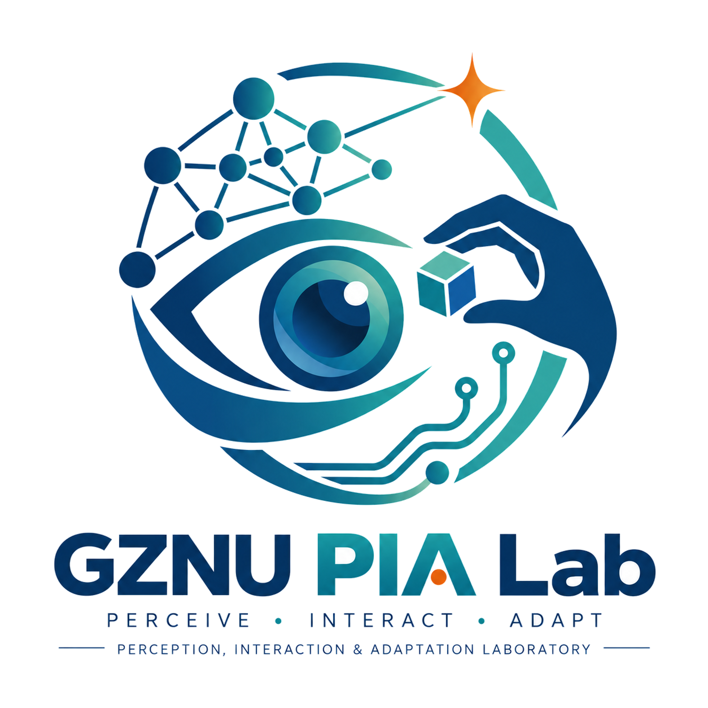

  

<h1 align="center">GZNU PIA Lab</h1>

  <strong>Perception · Interaction · Adaptation</strong> 
  感知 · 交互 · 适应

  <em>Perception, Interaction & Adaptation Laboratory · Guizhou Normal University</em>

---

## About

GZNU PIA Lab studies intelligent systems that can **perceive real-world environments, understand and generate interactions among humans, objects and environments, and adapt to changing conditions**.

Our work spans fundamental AI research and real-world intelligent systems, with an emphasis on reliable, adaptive and practically meaningful intelligence.

## PIA

| Perception | Interaction | Adaptation |
| --- | --- | --- |
| Understand visual, multimodal and sensor information from real environments. | Model, understand and generate interactions among humans, objects and environments. | Develop intelligent systems that remain reliable under distribution shifts, limited supervision and changing conditions. |

## Research Areas

- **Human–Object Interaction**
- **Generative AI & 3D Motion**
- **Reliable & Adaptive AI**
- **Computer Vision & Multimodal Learning**
- **AIoT & Real-World Intelligent Systems**

## Open Research

Public code, datasets, demos and project pages will be released here when they are ready for open access.

---

  <strong>Perceive · Interact · Adapt</strong>

