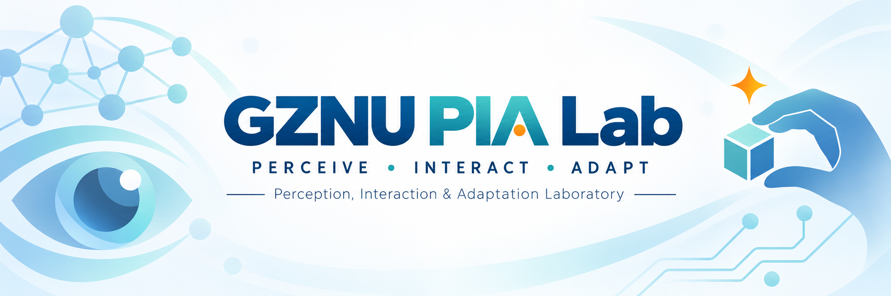

  <a href="https://github.com/GZNU-PIA-Lab">中文</a> · <strong>English</strong>

  

  <em>Guizhou Normal University</em>

## About

GZNU PIA Lab studies intelligent systems that can **perceive real-world environments, understand and generate interactions among humans, objects and environments, and adapt reliably to changing conditions**.

Our work connects fundamental AI research with real-world intelligent systems.

## Research Focus

**Perception**  
Visual, multimodal and sensor understanding in real environments.

**Interaction**  
Modeling and generation of human–object–environment interactions.

**Adaptation**  
Reliable intelligence under distribution shifts, limited supervision and changing conditions.

## Research Areas

- **Human–Object Interaction**
- **Generative AI & 3D Motion**
- **Reliable & Adaptive AI**
- **Computer Vision & Multimodal Learning**
- **AIoT & Real-World Intelligent Systems**

## Open Research

Public code, datasets, demos and project pages will be released here as they become ready for open access.
